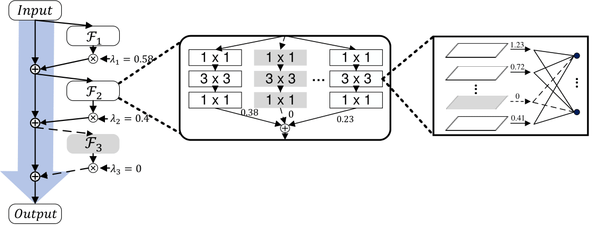
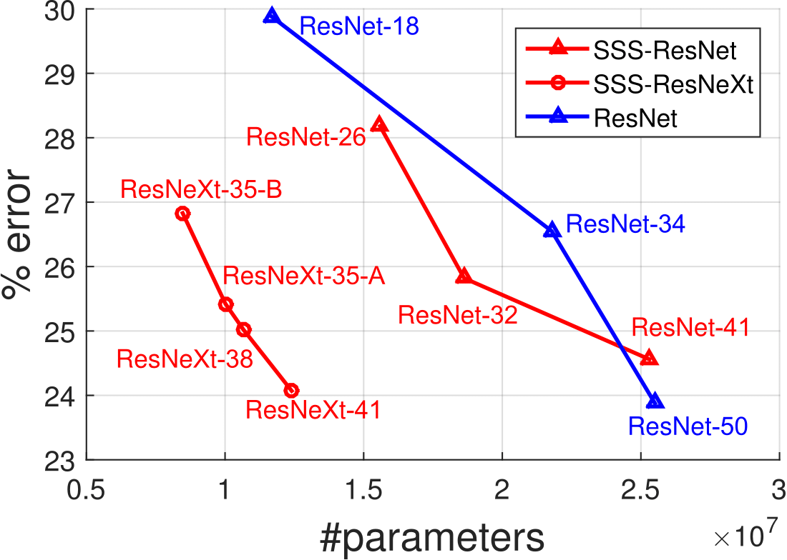
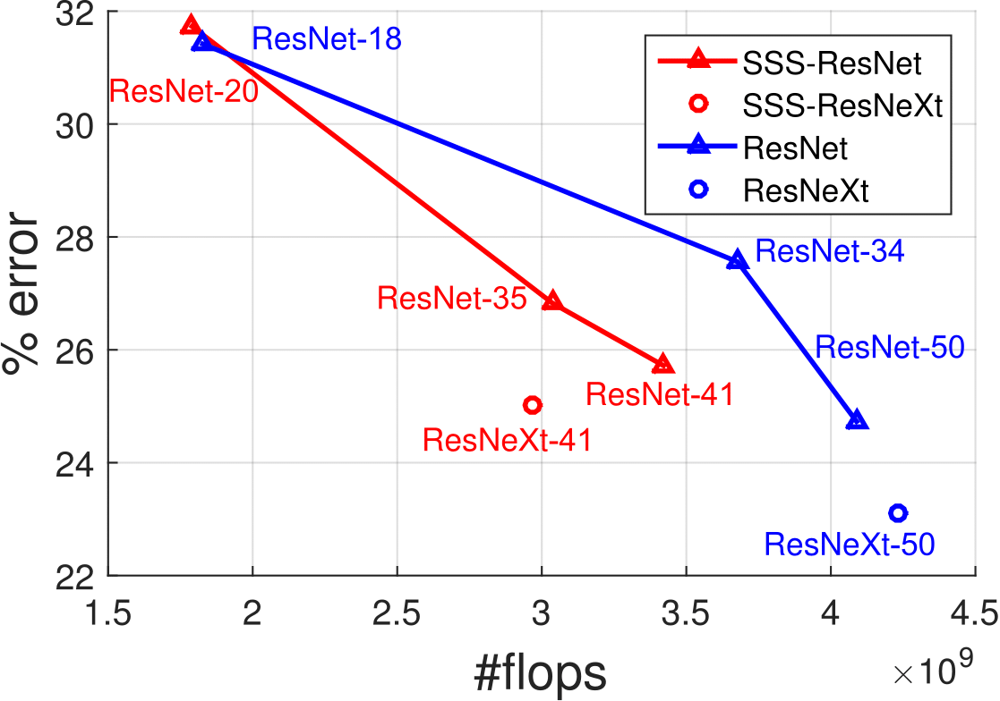

# sparse-structure-selection

This code is a re-implementation of the imagenet classification experiments in the paper [Data-Driven Sparse Structure Selection for Deep Neural Networks
](https://arxiv.org/abs/1707.01213) (ECCV2018).

<div align="center">
  
</div>

## Citation
If you use our code in your research or wish to refer to the baseline results, please use the following BibTeX entry.
```
@article{SSS2018
  author =   {Zehao Huang and Naiyan Wang},
  title =    {Data-Driven Sparse Structure Selection for Deep Neural Networks},
  journal =  {ECCV},
  year =     {2018}
}
```

## Implementation
This code is implemented by a modified [MXNet](https://github.com/huangzehao/incubator-mxnet-bk) which supports [ResNeXt-like](https://github.com/facebookresearch/ResNeXt) augmentation. (This version of MXNet does not support cudnn7)

## ImageNet data preparation
Download the [ImageNet](http://image-net.org/download-images) dataset and create pass through rec (following [tornadomeet's repository](https://github.com/tornadomeet/ResNet#imagenet) but using unchange mode)

## Run
- modify ```config/cfgs.py```
- ```python train.py```

## Results on ImageNet-1k
<div align="left">
  
  
</div>
